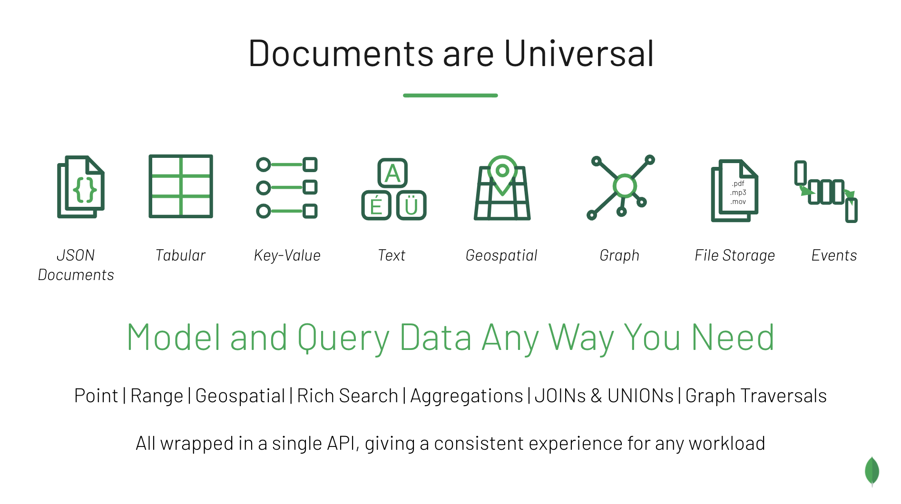

# Multi-Model Database Features in MongoDB

MongoDB enables you to simplify your system architectures by replacing multiple point solutions with a single, general-purpose database that supports many types of data. This repo includes examples for tabular, spatial and graph scenarios. See other demo repos for Files and Time Series. 
